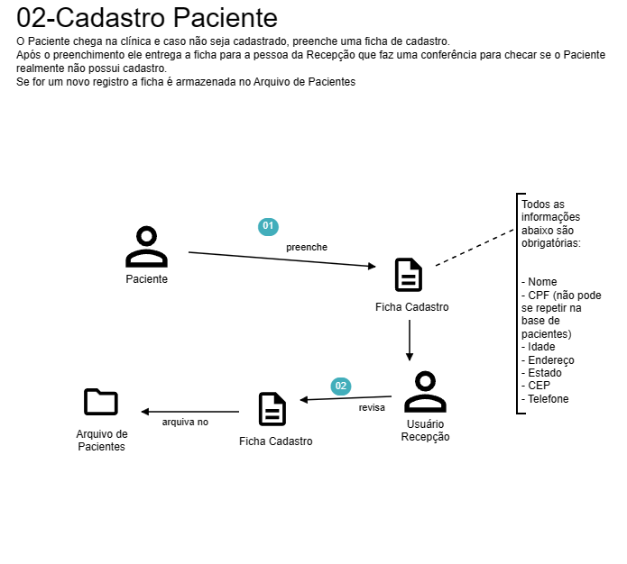
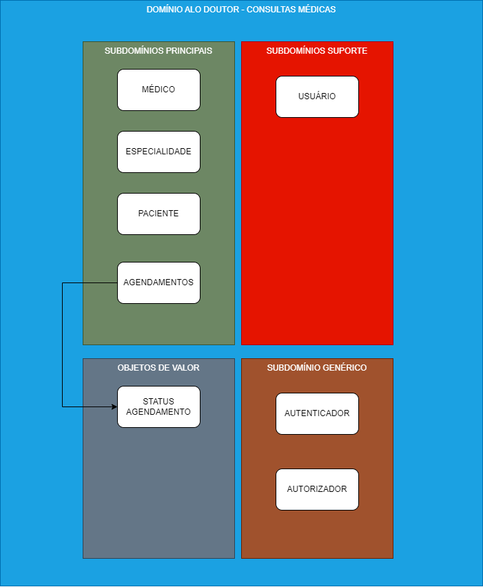

# Clínica Alô Doutor
## Índice
- [Clínica Alo Doutor](#clínica-alô-doutor)
    - [Sobre](#sobre) 
    - [Integrantes](#integrantes)  
    - [Tecnologias Utilizadas](#tecnologias-utilizadas)
    - [Solução](#solução)
        - [Como Executar o Projeto](#como-executar-o-projeto)
            -[Execução com Docker (recomendada)](#execução-com-docker-recomendada)
            -[Execução local](#execução-local)
  - [Levantamento de Requisitos](#levantamento-de-requisitos)
    - [Histórico da Clínica](#histórico-da-clínica)
    - [DDD](#ddd)
        - [Domain Storytelling](#domain-storytelling)
        - [Domínios e Contextos Delimitados Identificados](#domínios-e-contextos-delimitados-identificados)
            - [Domínios](#domínios)
            - [Contextos Delimitados](#contextos-delimitados)
    - [Critérios de Aceite](#critérios-de-aceite)
    

## Sobre
Este projeto faz parte do trabalho de conclusão da primeira fase da POSTECH FIAP de Arquitetura de Sistemas .Net com Azure.

[voltar](#índice)

## Integrantes

| Nome | RM | GitHub
------------ | ------------- | -------------
Alex Jussiani Junior | 350671 | https://github.com/AlexJussiani
Erick Setti dos Santos | 351206 | https://github.com/ESettiCalculist
Fábio da Silva Pereira | 351053 | https://github.com/fbiopereira
Marcel da Silva Fonseca | 348885 |
Richard Kendy Tanaka| 351234 | https://github.com/RichardKT88

[voltar](#índice)

## Tecnologias Utilizadas

| Tecnologias | Uso
------------ | -------------
[C#](https://docs.microsoft.com/en-us/dotnet/csharp/) | Linguagem de Programação
[.NET](https://dotnet.microsoft.com/) | Framework web
[Entity Framework Core](https://docs.microsoft.com/en-us/ef/core/) | Biblioteca para persistência de Dados (ORM)
[Serilog](https://serilog.net/) | Captura de Logs
[Visual Studio 2022](https://visualstudio.microsoft.com/pt-br/) | Editor de Código
[Docker](https://www.docker.com/) | Criação de Containers

[voltar](#índice)

## Solução
Desenvolvimento de uma Web Api em .NET Core com uma abordagem em Code First Migrations, e o Entity Framework para a persistência dos dados em um banco de dados Sql Server.

[voltar](#índice)

## Como Executar o Projeto

Existem duas opções para executar o projeto, utilizando o Docker ou executando localmente.

### Execução com Docker (recomendada)

1- Se você estiver no Windows instale o [WSL](https://learn.microsoft.com/pt-br/windows/wsl/install)
2- Instale o [Docker Desktop](https://www.docker.com/products/docker-desktop/)
3- Clone o repositório
4- No terminal vá até a pasta `/AloDoutor` e execute o comando `docker-compose up -d` para executar os containers das aplicações e do SQL Server
5- Abra o navegador e acesse:
-  [http://localhost:9191/swagger](http://localhost:9191/swagger) para a API de autenticação e autorização
-  [http://localhost:9090/swagger](http://localhost:9090/swagger) para a API AloDoutor

[voltar](#índice)

### Execução local

1- Clone o repositório

2- No terminal vá até a pasta `/AloDoutor` e execute o comando `dotnet restore` para restaurar as dependências do projeto

3- Atualização da base de dados (este passo não é obrigatório pois a aplicação foi configurada para executar as migrations automaticamente, mas caso queira executar manualmente siga os passos abaixo):
    - Execute o comando `dotnet tool install --global dotnet-ef`
    - Vá para a pasta `/AloDoutor.Api`
    - Execute o comando `dotnet ef database update`
    - Vá para a pasta `/Identidade.Api`
    - Execute novamente o comando `dotnet ef database update`

4- Executando os projetos:
    - Volte na pasta `/AloDoutor.Api` execute o comando `dotnet run` para executar o projeto
    - Abra um novo terminal na pasta `/Identidade.Api` execute o comando `dotnet run` para executar o projeto
    - Abra o navegador e acesse:
        -  `http://localhost:5002/swagger` para a API de autenticação e autorização
        -  `http://localhost:5001/swagger` para a API AloDoutor 

[voltar](#índice)

### Autenticação e autorização

- A aplicaçao cria um usuário padrão para testes com as seguintes credenciais:
    - Email (login): postechdotnet@gmail.com
    - Senha: Pos@123
    - Perfil: Administrador

- Com esse usuario é possível cadastrar novos usuários e realizar o login para acessar as funcionalidades do sistema.
- Usuários não administradores não tem acesso a funcionalidades de cadastro de usuários. Somente as funcionalidades da API AloDoutor
- Como fazer a autenticção:
    - A autenticação é na API de Autentcação e Autorização
    - Caso o login seja feito com subesso onde um token JWT será gerado
    - Este token deve ser utilizado na API AloDoutor para autorização dos endpoints e o token gerado é utilizado para autorizar o acesso as funcionalidades do sistema.

[voltar](#índice)

## Levantamento de Requisitos

### Histórico da Clínica

A clímica Alô Doutor provê um serviço gratuito de consultas médicas para a população utilizando o sistema de atendimento presencial. 

A  clínica foi fundada em 2010 e desde então vem atendendo a população de forma gratuita. A clínica conta com médicos voluntários que atendem a população de segunda a sexta das 8h às 18h. 

Os médicos realizam consultas humanizadas de 1 hora e tem um intervalo de almoço das 12:00 as 14:00.

Atualmente todo o trabalho da clínica é feito de forma manual em fichas de papel, porém a clínica está buscando modernizar o seu sistema de marcação de consultas para melhorar a experiência do paciente e do médico.

Nesse momento foi solicitado que a informatização fosse realizada sem melhorias no processo atual.

[voltar](#índice)

### DDD
Para a modelagem da solução utilizamos o Domain Driven Design e fizemos uso do Domain Storytelling para transformar o conhecimento sobre o domínio em requisitos para o desenvolvimento da solução via um Software.

#### Domain Storytelling

O time de desenvolvimento conversou com o responsável administrativo pela clínica e identificou os seguintes pontos:

 
 

 
 

[voltar](#índice)

#### Domínios e Contextos Delimitados Identificados

##### Domínios

[voltar](#índice)

#### Contextos Delimitados

[voltar](#índice)

### Critérios de Aceite

- Cadastro de Médico 
    - As seguintes informações são obrigatórias no cadastro:
        - Nome
        - CPF
        - CRM
        - Telefone
        - Endereço
        - Estado
        - CEP
    - A especialidade é opcional
    - Um médico pode atender em mais de uma especialidade
    - Não podem haver dois médicos com o mesmo CRM
    - Não podem haver dois médicos com o mesmo CPF
    - O CPF deve ter 11 caracteres númericos
    - Nome precisa ter no mínimo 2 caracteres
    - Estado e endereço deve ter mais do que 2 caracteres
    

 

- Cadastro do Paciente
    - As seguintes informações são obrigatórias:
        - Nome
        - CPF
        - Idade
        - Telefone
        - Endereço
        - Estado
        - CEP

    - Não podem haver dois pacientes com o mesmo CPF
    - O CPF deve ter 11 caracteres númericos
 

- Marcação de Consultas
    - O Paciente e o Médico já devem estar cadastrados
    - Só podem ser considerados médicos que tem especialidade associada
    - As consultas só podem ser agendadas para os seguites dias:
        - Segunda-feira a Sexta-feira das 09h às 18h
    - Cada consulta tem duração de 1 hora obrigatoriamente
    - Não há necessidade de considerar feriados
    - As consultas devem ser agendadas com um mínimo de 2 horas de antecedência
    - O Paciente não pode marcar duas consultas no mesmo dia e horário
    - A consulta pode ser cancelada pelos usuários do sistema
    - Para reagendamentos e cancelamentos são necessários no mínimo 2 dias de antecedência (desconsiderando fins de semana)
   
 

- Controle de Acesso
    - Todas as funcionalizadas devem ser executadas por um Usuário previamente cadastrado no sistema
    - O sistema deve ter 2 tipos de usuário:
        - Administrador: Acesso a cadastro de usuário e as funcionalidades do Alô Doutor
        - Operador: Acesso somente as funcionalidades do Alô Doutor
    - Se o usuário não estiver autenticado, ele não pode acessar as funcionalidades do sistema
    - O usuário cadastrado contará com nome, cpf e email. Todos são obrigatórios, sendo que:
        - O Email deve ser válido
        - A Senha deve ter o mínimo de 6 caracteres
            - A senha deve ser composta por 1 carater não alfanúmerico, 1 digito (0-9), 1 letra caixa baixa (a-z), 1 letra caixa alta (A-Z)  
            - No momento do cadastro precisa ser inserida 2 vezes

[voltar](#índice)